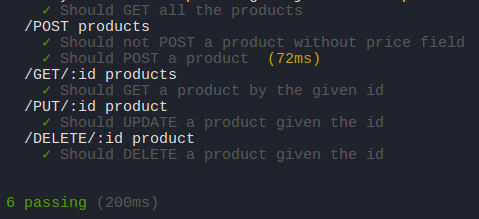

Simple Node.js - Express API (Product CRUD)
===========================================

Introduction
------------
Simple API using Node.js, Express.js and MongoDB to store data.
CRUD Operations on a Product (GET, POST, PUT and DELETE)

Installation
------------

    $ npm install
    $ NODE_ENV={development, test, production}
    $ npm start

Testing
-------

API Endpoints test is done with [Mocha](https://mochajs.org/) and [Chai](http://chaijs.com/).
It can be run with `$ npm test`
    

